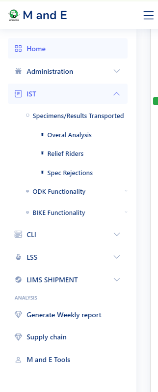

# Lab-Supporting-System
 Portal for Data Visualisation of the LSS Project

<<<<<<< Updated upstream

 ## Visualisation  Libraries Used
=======
 # Visualisation  Libraries Used
>>>>>>> Stashed changes
 <ul>
 <li> <a href="https://echarts.apache.org/en/index.html"> Echarts </a> </li>
 <li> </li><a href="https://www.highcharts.com/demo"> Highcharts </a>  </li>
 </ul>

<<<<<<< Updated upstream
### Ajax usage for interactiveness 
### How the Portal looks like 
=======
# Ajax usage for interactiveness 
# How the Portal looks like 
>>>>>>> Stashed changes

<<<<<<< Updated upstream

=======

>>>>>>> Stashed changes
